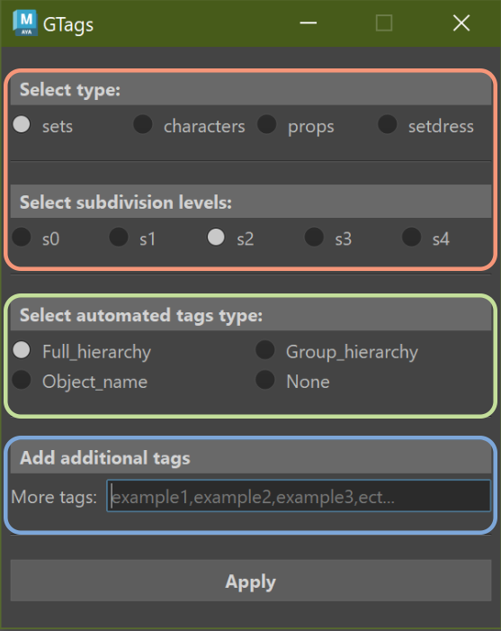

# GTags

GTags is a tool to add Guerilla Tags to your meshes and is designed to be as fast and practical as possible. It is advised to correctly rename your outliner for better results.

## Maya Version

GTags was designed on Maya 2024. If your version is 2025 or more, this plugin won't be supported.

## Installation 

* Download this repository into your maya scripts folder under your maya home folder, usually at "C:\Users\YourUserName\Documents\maya\scripts" 

* Open Maya and launch the Script Editor

* Paste the following code

```python
import GTags.gtags_plugin
GTags.gtags_plugin.run()
GTags.gtags_plugin.shelf()
```

It will create a Button on the Custom Shelf of Maya with this icon 

## How to use



* <p style="color:red">Type and subdivision levels</p>
These two functions are mandatory. Choose the type of asset they are and the subdivision levels you wish to apply in the Guerilla render engine.

* <p style="color:green">Automated tags</p>
For better results, I recommend naming correctly the groups and meshes in your outliner with the name of the tags you wish to apply for the automated tags tool.

 * Full hierarchy: Writes the name of your selected meshes as well as all of the groups they are stored under

 * Group hierarchy: Writes the name of all of the groups your selected meshes are stored under

 * Object name:  Writes only the name of your selected meshes

 * None: No automated tags are applied


* <p style="color:blue">Additional tags</p>
If you wish to add specific words as tags you can add them here

You can select groups to apply your tags under, GTags will select all the meshes stored in this group and apply the tags only on those meshes.
GTags also has a security where if it detects that your meshes already have Guerilla Tags attributes, it will ask for your permission to override them.

## Licence

GTags is available under the MIT License. You can use it for commercial or non-commercial projects. Be sure to credit me in the project and documentation.

## Project status

Update from Pyside2 to Pyside6 for Maya versions 2025 and after.
